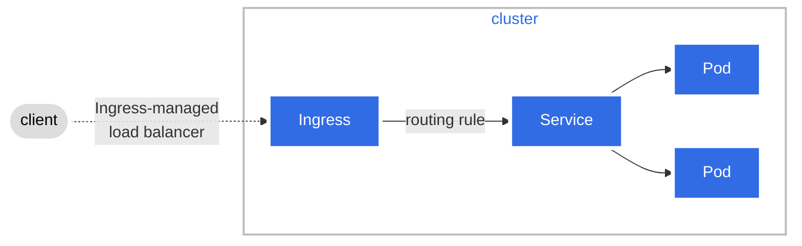

# Ingress

Ingress 는 클러스터 내부 서비스로의 외부 접근 (typically HTTP) 을 관리하는 API object 이다.

Ingress 는 또한 load balancing, SSL termination 과 name-based 가상 호스팅을 지원한다.

## Terminology

- Node: Kubernetes 의 worker maching, cluster 의 일부
- Cluster: Kubernetes 에 의해 관리되는 컨테이너화된 애플리케이션을 실행하는 Nodes 의 집합
- Edge router: 클러스터에 방화벽 정책을 강제하는 router. Cloud provider 가 관리하는 gateway 혹은 물리적인 하드웨어 일 수 있다.
- Cluster network: Kubernetes networking model 에 대응하는, cluster 내부의 물리적, 논리적 link 집합
- Service: Label selectors 를 이용해 Pods 를 식별하는 Kubernetes Service

## What is Ingress?

Ingress 는 클러스터 외부에서 클러스터 내부의 서비스로의  HTTP, HTTPS routes 를 제공합니다. Traffic routing 은 ingress 자원에 정의 된 규칙에 따라 제어됩니다.

아래는 전달 받은 모든 요청을 Service 로 전달하는 Ingress 예시 입니다.

